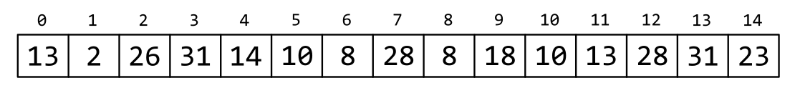
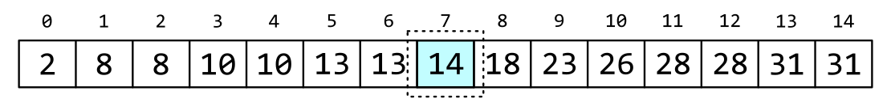
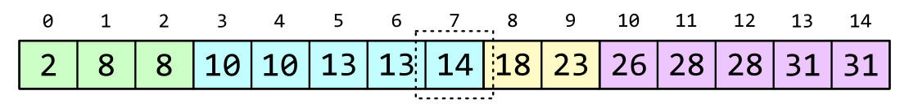
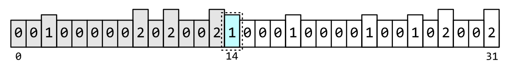

# Введение

В задачах статистики и цифровой обработки сигналов нередко возникает потребность в вычислении медианы некоторого массива данных. Обычно нужно вычислить медиану от нескольких значений, что реализуется относительно просто и работает быстро. Но бывают случаи, когда массив содержит тысячи или десятки тысяч элементов, а машинного времени и ресурсов не очень много. В этом случае может помочь алгоритм binmedian со средней сложностью O(n), или его модификация binapprox, которая вычисляет приближенную медиану, но гарантированно за O(n).

В этой статье рассматривается рекурсивная реализация алгоритма binmedian, вычисляющая точное значение медианы для массива целых чисел конечной разрядности. Алгоритм имеет сложность строго O(n).

# Исходные данные

В качестве примера возьмём массив из `15` беззнаковых чисел (рис.1).

Найдём медиану обычным способом, т.е. отсортируем массив и возьмём средний элемент (рис.2).

Средний элемент имеет номер `7`. Его значение, а соответственно и значение медианы равно `14`. Это число мы будет использовать в дальнейшем для проверки корректности описанных методов.

# Метод binmedian

Как известно, сортировка - это довольно затратная задача для выполнения "в железе". К счастью, существует способ избежать этой процедуры с помощью метода вычисления медианы под названием binmedian. В общем случае он позволяет вычислить точное значение медианы без использования сортировки *в среднем* за O(n). В случае целых чисел, как будет показано ниже, с помощью этого метода вычисляется точное значение *строго* за O(n).

Для вычисления медианы методом binmedian нужно построить гистограмму входного массива чисел, а затем последовательно складывать значения бинов, пока сумма не станет больше половины длины последовательности (номера центрального элемента массива).

В качестве примера построим гистограмму из четырёх бинов. Для этого разобьем диапазон чисел в массиве на четыре части. С учётом входных значений, диапазоны бинов будут следующие (каждое значение - это полуинтервал [a;b), в него входят значения большие или равные левой границе, и меньшие правой границы): `[2;10), [10;17), [17;24), [24;32)`.

На рис.3 цветами выделены интервалы в отсортированном массиве.

Вычислим значения бинов гистограммы, а затем просуммируем их слева направо до тех пор, пока сумма не превысит число `7` (индекс среднего элемента массива). Бин, на котором остановился счёт будет тем бином, в интервале которого находится медиана. В нашем случае это бин под номером `1`, т.е. медиана находится в интервале `[10;17)`. Гистограмма показана на рис.4.

Нетрудно вычислить сложность этого метода. Количество операций равно n \* k + c, где n - количество элементов в массиве, k - количество операций, необходимых для обновления гистограммы, c - расходы на подготовку гистограммы и сложение значений бинов. Т.к. k и c константы (c зависит от разрядности чисел и в общем случае не зависит от количества элементов), то время вычисления зависит (линейно) только от количества элементов массива. Таким образом сложность метода равняется O(n).

# Точное вычисление медианы

Чтобы вычислить точное значение медианы, очевидно нужно сделать гистограмму такой длины, чтобы интервал каждого бина был равен единице. Тогда результирующее значение точно попадёт в значение медианы (напомню, мы производим вычисления в целых числах).

В нашем случае необходима гистограмма от минимального значения (`2`) до максимального (`31`) с количеством бинов `30`.

Чтобы упростить схему (а мы же в итоге планируем сделать это в железе?), можно взять полный интервал разрядности чисел. В этом случае адресом бина будет служить просто значение очередного числа из массива. Для нашего примера я специально выбрал числа шириной `5` бит, то есть их значения лежат в диапазоне от `0` до `31`.

Построим гистограмму. Как и в предыдущем случае, будем складывать значения бинов слева направо пока сумма не превысит `7` (рис.5). В итоге мы остановимся на бине `14` с суммой, равной `8`. Номер бина и есть значение медианы.

Сложность алгоритма не изменилась, но увеличился размер гистограммы. А что если у нас будут числа большей разрядности? Строить гистограмму например для 32-битных данных очень расточительное занятие - понадобится массив памяти на 4 миллиарда слов.

# Точное вычисление медианы для чисел с большой разрядностью

В этом случае можно разбить вычисление на несколько этапов. Сначала, используя старшие разряды чисел вычислить приближенное значение медианы. Затем, опускаясь по разрядам, прийти к точному значению. Количество этапов может быть произвольным в зависимости от разрядности чисел и требований к объёму используемой памяти.

У нас разрядность небольшая, по этому вычислим медиану в два этапа. Для этого разобьём наш интервал разрядности (`5` бит) на две части. Первая часть будет состоять из `3` бит, вторая - из `2` бит.

Построим гистограмму длиной `8` используя только `3` старших бит для индексации бинов.

Так же, как и в предыдущих случаях, просуммируем бины слева направо и определим номер бина, на котором сумма превысит индекс центрального элемента. В нашем случае это бин с номером `3` (рис.6). Значение старших `3` бит медианы будет равно этому номеру, что в бинарном виде будет выглядеть как `0b011`.

Теперь можно вычислить точное значение медианы, используя наше знание о значении её старших бит. Для этого построим вторую гистограмму. Для её построения будем отбирать числа, старшие биты которых равны значению, полученному на предыдущем шаге - `0b011`. Для индексации гистограммы будем использовать только младшие `2` бит этих чисел, т.е. длина гистограммы будет равняться `4`.

На этом шаге мы должны ввести новую операцию, которой не было в ранее. Необходимо запомнить количество чисел, значение старших бит которых меньше значения, полученного на предыдущем шаге. Фактически это ещё один бин гистограммы с интервалом "меньше меньшего". Значение этого бина будет необходимо на последнем шаге вычислений.

Остался последний шаг - просуммировать бины и остановиться на том, где сумма превысит индекс центрального элемента. Однако, в отличие от предыдущих примеров, начальное значение суммы равно не нулю, а количеству чисел, старшие биты которых меньше старших битов медианы (тот самый бин "меньше меньшего"). Нетрудно посчитать их количество - `5` штук.

В результате последовательного суммирования (показано на рис.7) мы получили номер бина - `2`. Это и есть значение младших бит искомой медианы - `0b10`. Склеив всё вместе получим ответ - `0b01110`, или `14`.

Несмотря на то, что число итераций удвоилось, время потраченное на вычисления всё ещё линейно зависит от количества элементов массива. Т.е. сложность алгоритма осталась той же.

# Заключение

В статье был показан метод быстрого вычисления медианы для массива челых чисел с использованием алгоритма binmedian. Автором был реализован описанный алгоритм в виде RTL, который был успешно использован в ПЛИС Xilinx серий 7 и US+.

Исходный код статьи вы сможете найти по ссылке: <https://github.com/punzik/fast-median-article>. Там вы так же найдёте код на Python, которым вычислялись значения, приведенные в статье.
